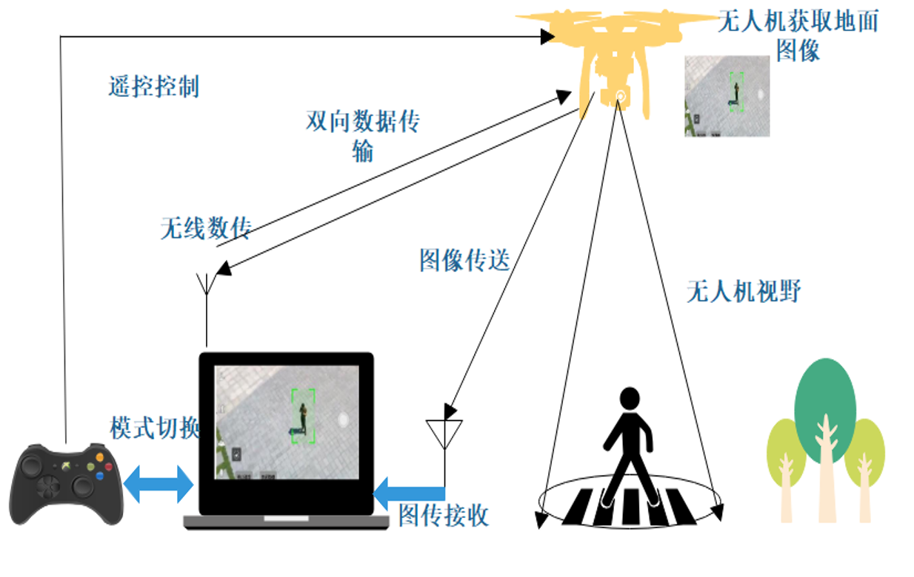
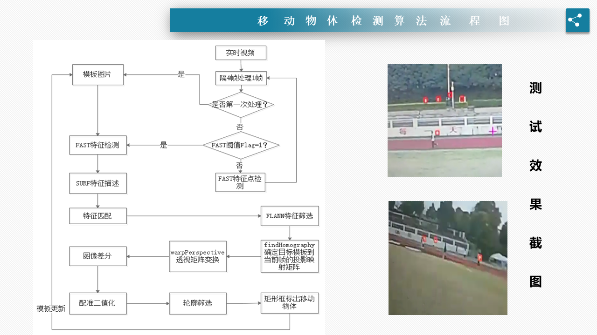

# Dynamic_detection_and_tracking

## Description

https://www.bilibili.com/video/BV1sV411U77m/

https://www.bilibili.com/video/BV1Th411o76a/

https://blog.csdn.net/qq_26573899/article/details/80800748

## 项目报告

### 背景
        无人机分为很多种，四轴飞行器是旋翼式无人机的一种，简称四轴,是一种有四个螺旋桨的旋翼式飞行器。随着电子技术和计算机技术的快速发展，无人机有着微型化，智能化和平台化的发展趋势。在军事，民用和科研等领域都有着广阔的前景。在城市交通方面，无人机可替代传统的固定式监控探头实现道路监控、边境巡逻等任务。同时可结合机载相机所得到的高精度图像实现城市三维模型的构建，来指导城市的合理规划与建设。在农业方面，通过无人机搭载光谱相机测量农作物表面能量的发射并以此监测农作物生长也己有所实践。在快递领域，美国亚马逊，中国的顺丰都在开展无人机快递业务。亚马逊宣称无人机可以实现一定大小的货品配送，只需录入收件人的GPS信息，无人机就可以在规定时间内将货物投递到客户收货地点。

### 现状
      无人机的空中视角，可以很方便的对地面进行实时监控。同时无人机可以在空中灵活快速地移动，因此可以迅速对地况作出反应。 现在的监控设备一般都是固定区域的，不可避免的会出现监控死角;另外，在一些地方以及一些恶劣的环境下，摄像机等设备的安装布线及维护都是大问题。固定点视频监控在可视化管理领域需求多样化的趋势下，需要有像无人机航拍这样的新设备在特殊情况下提供技术保障。
      本项目以基于OpenCV库的四轴飞行器目标追踪系统为研究对象，对动态背景下移动物体检测算法、物体追踪算法和飞行控制算法进行多方面的分析。搭建了搭载图传相机的四轴飞行器追踪平台。主要包括无人机机架设计，以及嵌入式硬件平台。图像处理方面，通过特征点匹配检测移动物体，利用压缩感知算法追踪目标，在保证追踪精确度的前提下提高跟踪算法抗干扰性。电脑通过无线数传将目标的相对位置返回给无人机，作为无人机跟踪控制部分的输入参数。最后对无人机的地面站进行了软件设计。

# 
### 方案设计

### 硬件配置

### 动态检测

### 物体跟踪

### 效果展示

